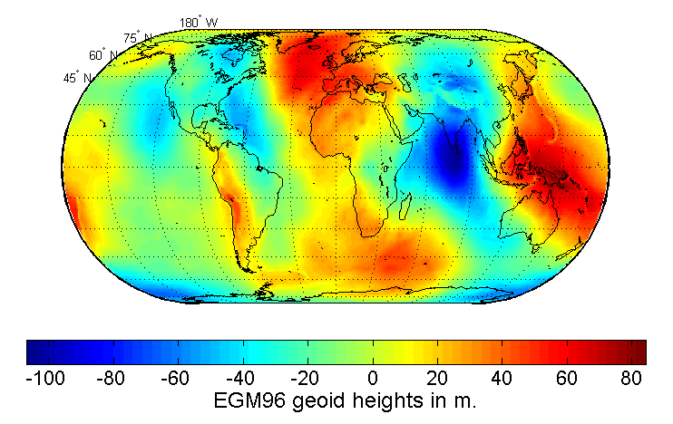

EGM96
=====

### Introduction

This code is meant to correct the 'default' altitude measurements given by GPS systems, that measures altitude against the reference ellipsoid and needs to be corrected to match the actual geoid.  
For a any given point whose latitude and longitude is specified, it will output an altitude offset.

### How to use

The library is meant to be easy to use, and especially easy to embed into your own softwares.

* Include these three files into your project: _EGM96.c_, _EGM96.h_ and _EGM96_data.h_
* Call the _egm96_compute_altitude_offset()_ function:

```cpp
/*!
 * \brief Compute the geoid undulation from the EGM96 potential coefficient model, for a given latitude and longitude.
 * \param latitude: Latitude (in degrees).
 * \param longitude: Longitude (in degrees).
 * \return The geoid undulation / altitude offset (in meters).
 */
double egm96_compute_altitude_offset(double latitude, double longitude);
```


## About

### About this implementation

This implementation is a fork of [a project](https://sourceforge.net/projects/egm96-f477-c) by D.Ineiev, which is translation from Fortran to C of another [EGM96 implementation](https://earth-info.nga.mil/GandG/wgs84/gravitymod/egm96/egm96.html) from the [National Geospacial-intelligence Agency](https://earth-info.nga.mil/).

The code has been cleaned up (a lot), the documentation improved, and most importantly the EGM96 correction and harmonic coefficients are now precomputed and embeded into an header file.

This makes the code self sufficient (removing the need to access filesystem at run time) while saving a lot of both CPU time (precomputations are done once and offline) and disk space (reducing the total size from around 10.6 MB to less than 3.3 MB).

### About the original implementation

The program is designed to use the potential coefficient model EGM96 and a set of spherical harmonic coefficients of a correction term.  
The correction term is composed of several different components. The primary one being the conversion of a height anomaly to a geoid undulation.  
The principles of this procedure were initially described in the paper:
- Use of potential coefficient models for geoid undulation determination using a spherical harmonic representation of the height anomaly/geoid undulation difference by R.H. Rapp, Journal of Geodesy, 1996.

This program is designed to be used with the constants of EGM96 and those of the WGS84 (g873) system. The undulation will refer to the WGS84 ellipsoid.  

Specific details on the undulation computation will be found in the joint project report describing the development of EGM96.  
This program is a modification of the program described in the following report:
- A fortran program for the computation of gravimetric quantities from high degree spherical harmonic expansions, Richard H. Rapp, report 334, Department of Geodetic Science and Surveying, the Ohio State University, Columbus, 1982.

### About the science

The [World Geodetic System](https://en.wikipedia.org/wiki/World_Geodetic_System) (WGS) is a standard for use in cartography, geodesy, and satellite navigation including GPS. This standard includes the definition of the coordinate system's fundamental and derived constants, the ellipsoidal (normal) [Earth Gravitational Model](https://en.wikipedia.org/wiki/Earth_Gravitational_Model) (EGM), a description of the associated [World Magnetic Model](https://en.wikipedia.org/wiki/World_Magnetic_Model) (WMM), and a current list of local datum transformations.

The **EGM96 geoid defines** the nominal sea level surface by means of a spherical harmonics series of degree 360. The deviations of the EGM96 geoid from the WGS 84 reference ellipsoid range from about −105 m to about +85 m.



In geodesy, a **reference ellipsoid** is a mathematically defined surface that approximates the geoid, which is the truer, imperfect figure of the Earth, or other planetary body, as opposed to a perfect, smooth, and unaltered sphere, which factors in the undulations of the bodies' gravity due to variations in the composition and density of the interior, as well as the subsequent flattening caused by the centrifugal force from the rotation of these massive objects (for planetary bodies that do rotate).


## Get involved!

You can browse the code on the GitHub page, submit patches and pull requests! Your help would be greatly appreciated ;-)


## License

```
Copyright (c) 2006 D.Ineiev <ineiev@yahoo.co.uk>
Copyright (c) 2020 Emeric Grange <emeric.grange@gmail.com>

This software is provided 'as-is', without any express or implied warranty.
In no event will the authors be held liable for any damages arising from
the use of this software.

Permission is granted to anyone to use this software for any purpose,
including commercial applications, and to alter it and redistribute it
freely, subject to the following restrictions:

1. The origin of this software must not be misrepresented; you must not
   claim that you wrote the original software. If you use this software
   in a product, an acknowledgment in the product documentation would be
   appreciated but is not required.
2. Altered source versions must be plainly marked as such, and must not be
   misrepresented as being the original software.
3. This notice may not be removed or altered from any source distribution.
```
